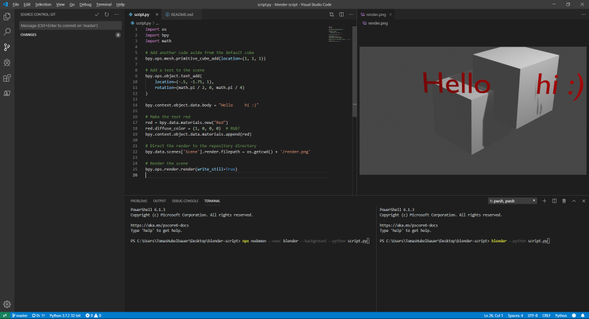

# Blender Script

[**LIVE**](https://tomashubelbauer.github.io/blender-script)

1. Add Blender to `%PATH%` and run `pip install bpy`
2. Open the repository in VS Code
3. Open `script.py` and `render.png` in split view side by side
3. Open the VS Code terminal
4. Run `npx nodemon --exec blender --background --python script.py`
5. Observe the `render.png` preview refresh after each save
6. Debug by either:
  - Removing `--background`
  - Splitting terminal and running `blender --python script.py`
  - Pressing F12 in Blender to preview render

## To-Do

Figure out how to get autocompletion for `bpy`.

Set up a GitHub Actions workflow which installs Blender and runs
`blender --python script.py` on every push and pushes `render.png`
to the repository.
